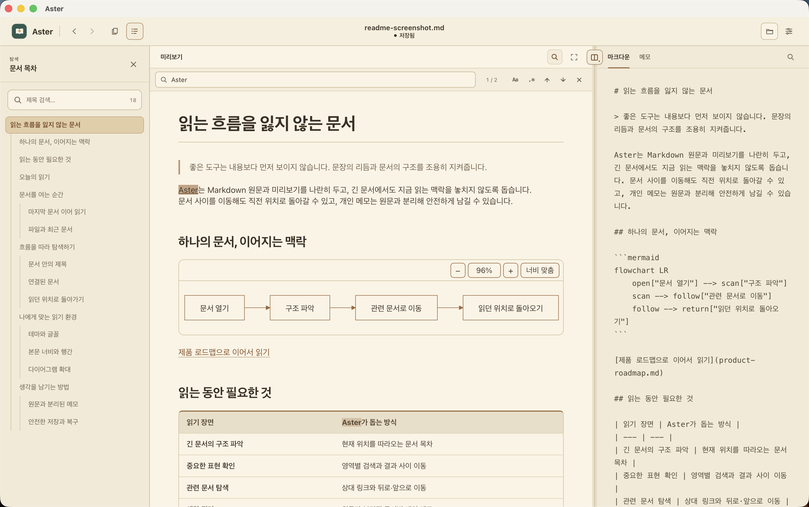

# Aster

읽기 좋은 Markdown을 위한 데스크톱 뷰어.

> Aster는 Markdown을 더 많이 쓰기 위한 앱이 아니라, 이미 존재하는 문서를 편하게 읽기 위한 앱입니다.

## 다운로드

[GitHub Releases](https://github.com/youseonghyeon/aster/releases/latest)에서 최신 버전을 내려받을 수 있습니다.

| 운영체제 | 설치 파일 | 지원 범위 | 배포 상태 |
| --- | --- | --- | --- |
| macOS | Universal `.dmg` | Apple Silicon 및 Intel | Developer ID 서명 및 Apple 공증 완료 |
| Windows | x64 `-setup.exe` | Windows 10·11 64비트 | 코드 서명되지 않음 |

macOS에서는 DMG를 열고 Aster를 Applications 폴더로 드래그하면 됩니다. Windows 설치 파일은 아직 코드 서명 인증서가 없어 Microsoft Defender SmartScreen 경고가 표시될 수 있습니다. 파일 무결성은 각 릴리스에 첨부된 `SHA256SUMS.txt`에서 확인할 수 있습니다.

## 읽기 환경

| 구분 | 지원 항목 |
| --- | --- |
| 테마 | 밝게, 종이, Solarized, 세피아, Nord, Dracula, Gruvbox, 야간 |
| 글꼴 | Pretendard, Noto Sans KR, Noto Serif KR, 시스템 고딕 |
| 행간 | 1.4, 1.5, 1.72, 1.9 |
| 확대 | 80%부터 150%까지 단계 조절 |

```ts
const aster = {
  purpose: "편안하게 읽기",
  supports: ["표", "체크리스트", "코드 블록"],
};
```

## 왜 Aster인가

긴 정책 문서와 기술 문서를 읽을 때 낮은 가독성, 부족한 탐색 기능, 메모할 공간이 없는 문제에서 시작했습니다. 원문의 구조는 그대로 유지하면서 글꼴, 행간, 너비와 색상을 사용자의 읽기 환경에 맞게 조정하는 것을 목표로 합니다.

## 주요 기능

### 현재 위치를 보여주는 문서 목차

- Markdown 제목을 문서 구조에 맞는 계층형 목차로 표시
- 미리보기 스크롤에 따라 현재 읽는 제목을 자동 강조
- 제목 검색과 목차 항목 선택을 통한 빠른 이동
- 필요할 때만 열고, 작은 창에서는 본문 위에 겹쳐 표시해 읽기 폭을 보존
- 넓은 창에서는 집중 모드, Markdown/메모 전환과 패널 검색 중에도 열린 목차 유지
- 작은 창의 모달 목차에서는 작업 공간을 조작하기 전에 목차를 닫고 대상 입력으로 이동

### 영역마다 독립적인 검색

- 마크다운·메모·미리보기 패널별 검색 버튼과 `Command/Ctrl+F`
- 대소문자 구분과 정규식 검색
- 이전·다음 결과 순환과 미리보기 전체 결과 강조
- 검색을 닫으면 이전 포커스, 선택과 스크롤 위치 복원
- 넓은 창에서 문서 목차와 함께 검색할 때 `Escape`는 검색을 먼저 닫고 목차를 유지

### 미리보기에 집중하기

- 미리보기 헤더의 집중 모드 버튼으로 마크다운·메모 영역을 완전히 숨김
- 미리보기 검색, 문서 목차와 읽기 설정은 그대로 사용
- 집중 모드로 숨겨지는 Markdown·메모 검색은 닫고 검색 전 선택·스크롤을 복원하며, 미리보기 검색은 유지
- 넓은 창의 목차는 유지하며, 작업 공간에 포커스한 `Escape`로 종료하면 패널 위치, 분할 비율, 선택과 스크롤 위치 복원

### 읽기와 입력을 나란히

- Markdown 입력과 미리보기를 좌우로 동시에 표시
- 필요할 때 양쪽 문서 위치를 함께 따라가는 양방향 스크롤 동기화
- 패널 배치 메뉴에서 두 패널의 좌우 위치를 전환
- 패널 위치를 바꿀 때 너비 비율도 함께 전환
- 가운데 구분선을 움직여 원하는 비율로 조절

### 원문과 분리된 개인 메모

수정할 수 없는 정책 문서에도 문서별 개인 메모를 남길 수 있습니다. 메모는 원본 Markdown을 변경하지 않고 기기에 로컬로 저장됩니다.

- `마크다운 / 메모` 탭으로 작성 영역 전환
- 미리보기를 보면서 메모 작성
- 문서 경로를 기준으로 메모를 구분하고 자동 저장
- 작성된 메모가 있으면 탭에 상태 표시

### Markdown 표현

- GitHub Flavored Markdown
- 표와 체크리스트
- 인라인 코드와 코드 블록
- 언어별 구문 강조
- 중첩 괄호를 구분하는 테마별 레인보우 색상
- Mermaid fenced code block의 테마 대응 다이어그램 미리보기와 항목별 확대·축소·너비 맞춤
- 긴 표를 위한 내용 기반 열 너비와 가로 스크롤
- 한글 줄바꿈과 문장 가독성을 고려한 본문 폭

읽기 설정은 기기에 저장되어 다음 실행에서도 유지됩니다.

## 파일 열기

상단의 폴더 버튼 또는 메뉴의 `File → Open…`으로 `.md`, `.markdown` 파일을 열 수 있습니다.

현재는 UTF-8 텍스트 파일을 지원하며, 안전한 처리를 위해 10MB 이하의 Markdown 파일만 엽니다.

상단의 문서 버튼을 누르면 `파일`과 `최근` 보기를 전환할 수 있습니다. 파일 보기에서는 한 폴더의 Markdown과 이미지를 계층 구조로 탐색합니다. 단일 클릭은 항목을 선택하고, `Enter` 또는 더블 클릭으로 Markdown을 엽니다. 선택한 폴더, 펼친 위치와 넓은 창의 사이드바 너비는 기기에 저장됩니다.

최근에 연 Markdown 문서는 최대 10개까지 저장됩니다. 현재 문서에서 수정 중인 Markdown이 있으면 다른 문서로 이동하기 전에 저장 여부를 확인합니다. 삭제되었거나 접근할 수 없는 최근 문서는 연결 끊김 상태로 남아 복구 후 다시 열 수 있습니다.

열어 둔 파일이 다른 앱에서 변경되면 Aster에 미저장 변경이 없을 때 즉시 최신 내용을 적용하면서 포커스·선택·스크롤 위치를 유지합니다. Aster에서도 수정 중이었다면 외부 변경 적용, 현재 내용으로 덮어쓰기 또는 취소를 선택할 수 있습니다. 외부 파일이 삭제되거나 읽을 수 없으면 다음 행동을 결정할 수 있도록 알려줍니다.

## 단축키

| 기능 | macOS | Windows / Linux |
| --- | --- | --- |
| 파일 열기 | `Command+O` | `Ctrl+O` |
| 현재 문서 저장 | `Command+S` | `Ctrl+S` |
| 확대 | `Command+=` | `Ctrl+=` |
| 축소 | `Command+-` | `Ctrl+-` |
| 실제 크기 | `Command+0` | `Ctrl+0` |
| 메모 열기·닫기 | `Command+Shift+M` | `Ctrl+Shift+M` |
| 현재 영역 검색 | `Command+F` | `Ctrl+F` |

## 개발 환경

Aster는 Tauri 2, React 19, TypeScript와 Rust로 만들어졌습니다.

### 준비 사항

- Node.js
- pnpm
- Rust toolchain
- 운영체제별 Tauri 빌드 의존성

자세한 준비 과정은 [Tauri prerequisites](https://v2.tauri.app/start/prerequisites/)에서 확인할 수 있습니다.

### 실행

```bash
pnpm install
pnpm tauri dev
```

브라우저에서 프런트엔드만 확인하려면 다음 명령을 사용합니다.

```bash
pnpm dev
```

### 빌드

```bash
# 프런트엔드 검사와 빌드
pnpm build

# 데스크톱 앱 번들 생성
pnpm tauri build
```

## 로드맵

Aster는 읽기 경험을 흐리지 않는 범위에서 다음 기능을 확장할 예정입니다.

- [x] 현재 위치를 강조하는 문서 목차
- [x] 마크다운·메모·미리보기 개별 검색
- [x] 마크다운·메모 영역을 숨기는 미리보기 집중 모드
- [x] 최근 문서와 목차를 전환할 수 있는 사이드바
- [x] 선택한 폴더를 탐색하는 파일 사이드바
- [ ] 상대 경로 문서 링크와 뒤로·앞으로 이동
- [x] Mermaid 다이어그램 미리보기
- [ ] 문장에 연결하는 개인 메모
- [x] 외부 파일 변경 감지
- [x] 선택 가능한 입력·미리보기 스크롤 동기화

## 제품 원칙

새로운 기능은 다음 기준을 만족해야 합니다.

1. 긴 문서를 더 편하게 읽게 하는가?
2. 원문을 건드리지 않고 사용자의 생각을 보존하는가?
3. 기존 화면을 복잡하게 만들지 않는가?
4. 사용하지 않을 때 읽는 화면에서 물러나 있는가?
5. 본문 너비, 행간과 스크롤의 안정성을 해치지 않는가?

Aster는 기능의 수보다 읽는 경험의 완성도를 우선합니다.

## 라이선스

Aster는 [MIT License](LICENSE)로 배포됩니다.
